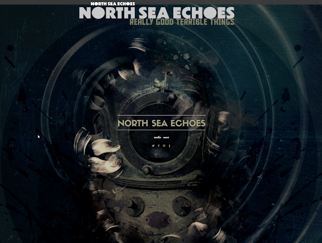

A selection of websites that I have created and maintained over the years.

**[NorthSeaEchoes.com](https://northseaechoes.com/)** (January 2024 - Present) Official website for North Sea Echoes, a project by Ray Alder and Jim Matheos.

---

**[KingsOfMercia.com](https://kingsofmercia.com)** (July 2022 - Present) Official website for Kings of Mercia, a project by guitarist Jim Matheos and vocalist Steve Overland.

---

**[TuesdayTheSky.com](https://tuesdaythesky.com)** (April 2017 - Present) Official website for Tuesday The Sky, an instrumental project by guitarist Jim Matheos.

---

**[JimMatheos.com](https://jimmatheos.com)** (August 2012 - Present) Official website for guitarist Jim Matheos ([Fates Warning](http://en.wikipedia.org/wiki/Fates_Warning), [OSI](http://en.wikipedia.org/wiki/OSI_\(band\)), [Arch/Matheos](http://www.archmatheos.com/)).

---

**[FatesWarning.com](https://fateswarning.com)** (January 2011 - Present) Official web site for the progressive metal pioneers, [Fates Warning](http://en.wikipedia.org/wiki/Fates_Warning).

---

**OSIband.com** (January 2012 - 2016) Official website for [OSI](http://en.wikipedia.org/wiki/OSI_\(band\)), a project by Jim Matheos and Kevin Moore (no longer available).

---

**FatesWarning.info** (1996 - 2011) "Unofficial" fan site for the progressive metal pioneers, [Fates Warning](http://en.wikipedia.org/wiki/Fates_Warning).

---

**Ivorygate.com/Redemption**  (2000 - 2006) Official original website for progressive metal band, [Redemption](http://en.wikipedia.org/wiki/Redemption_%28band%29) (no longer in use by the band). Go check out their current site - [RedemptionWeb.com](http://redemptionweb.com/)

---

**Lacerated.net** (2000 - 2001) Website designed for an underground metal magazine (no longer available).
